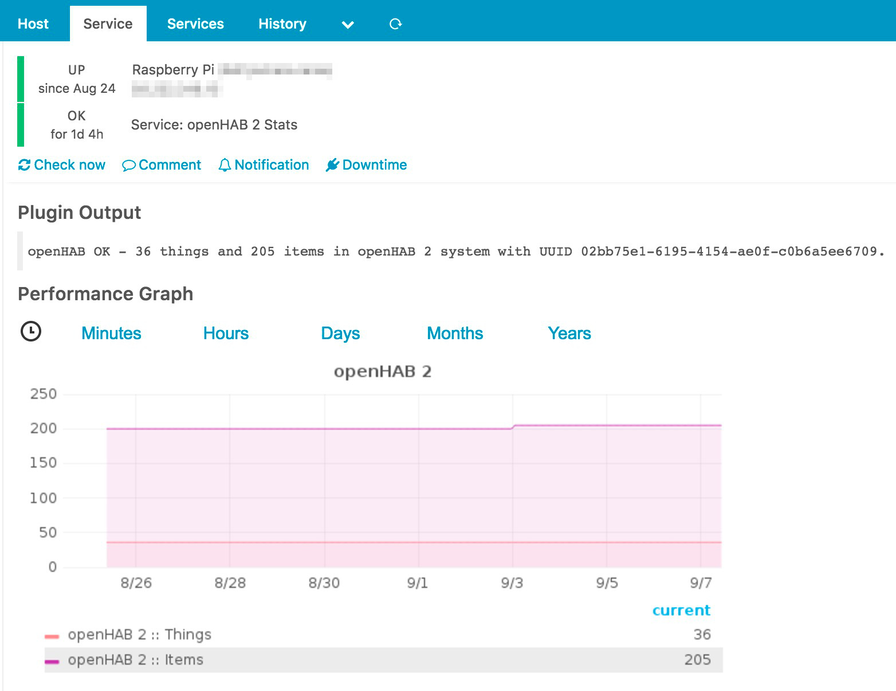
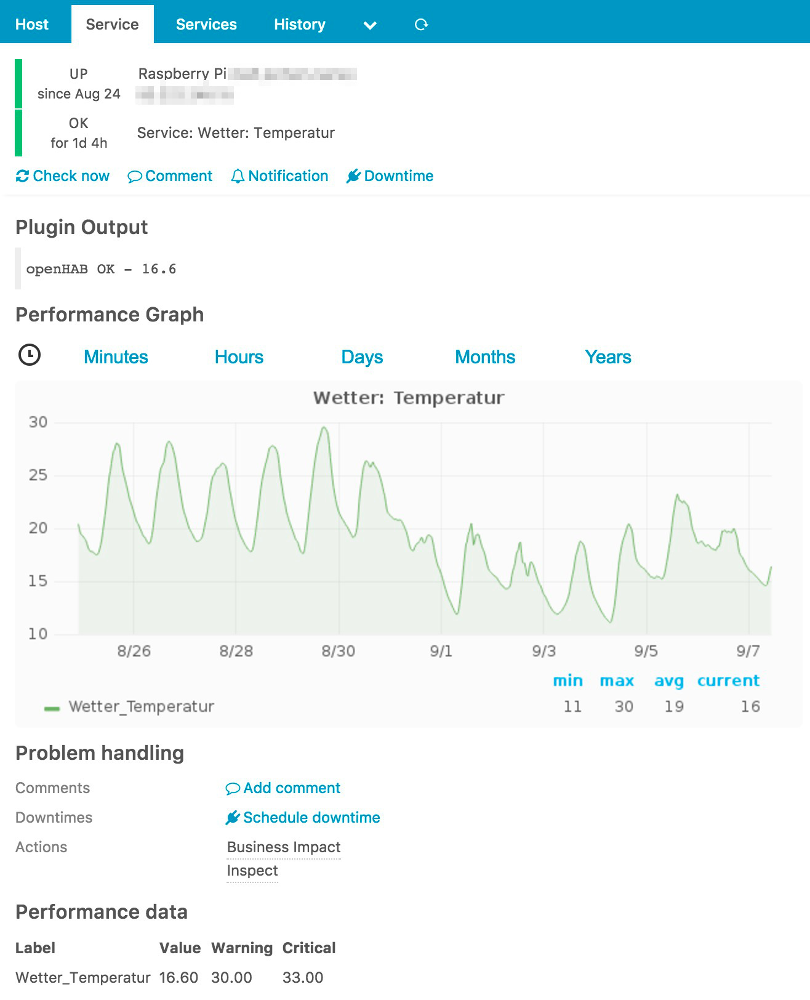

#### Table of Contents

1. [About](#whats-this-all-about)
2. [Requirements](#requirements)
3. [Arguments](#arguments)
4. [Icinga 2 CheckCommand](#icinga-2-checkcommand)
4. [Examples](#examples)
5. [Contributing](#contributing)

# What's this all about?
`check_openhab.py` helps you to integrate your openHAB (2 or 3) installation with Icinga 2.

One difficulty is, that there are naturally several different types of items:
* Number items like temperature or humidity
* Switch items which are typically ON or OFF
* Contact items which are typically OPEN or CLOSED
* Player items which can be PLAY, PAUSE and so on
* ...

And of course all items could be in unknown state when restarting; to avoid a lot of unnecessary noise you should use a persistence service of your choice to get all items in defined (*last known*) states on restart.

# Requirements
* openHAB (2 or 3) - openHAB 1.x will **not** work!
* python-2.7.x with *argparse*, *sys* and *requests* enabled

# Arguments
| Argument            | Description
| --------------------|----------------------------------------------------------------------
| `--host` / `-H`     | **Required.** Host your openHAB installation is running on
| `--port` / `-P`     | Port your openHAB REST API is listening on. Default: 8080
| `--protocol`        | Choose either HTTP or HTTPS. Default: HTTP
| `--stats` / `-S`    | Get thing and item count for your openHAB 2. Supports perfdata. Mutually exclusive to `--item`
| `--item` / `-I`     | Check a specific item (see examples below). Mutually exclusive to `--stats`
| `--warning` / `-W`  | Value Icinga 2 should exit WARNING for (see [examples](#examples))
| `--critical` / `-C` | Value Icinga 2 should exit CRITICAL for (see [examples](#examples))
| `--user` / `-U`     | Username which should be used to authenticate against openHAB 3 (or set API token here when)
| `--password` / `-p` | Password which should be used to authenticate against openHAB 3

# Icinga 2 CheckCommand
```
object CheckCommand "openhab" {
    import "plugin-check-command"
    command = [ PluginDir + "/check_openhab.py" ]
    arguments += {
        "--protocol" = "$openhab_protocol$"
        "--host" = "$openhab_host$"
        "--port" = "$openhab_port$"
        "--item" = {
		description = "openHAB 2 item name"
		value = "$openhab_item$"
		}
        "--warning" = "$openhab_warning$"
        "--critical" = "$openhab_critical$"
        "--stats" = {
		description = "General openHAB stats"
		set_if = "$openhab_stats$"
		}
        "--timeout" = "$openhab_timeout$"
	"--user" = "$openhab_user$"
	"--password" = "$openhab_password$"
    }
    vars.openhab_host = "$address$"
    vars.openhab_stats = false
}
```

# Examples
Performance data are processed in the following use cases:
* when using `check_openhab.py` with `--stats` 
* when using the script with `--item` **and** it is an item of type *Number*

#### Getting openHAB stats
```
$ ./openhab.py --host 10.8.0.10 --port 8080 --protocol http --stats
openHAB OK - 36 things and 200 items in openHAB system with UUID 02bb75e1-6195-4154-ae0f-c0b6a5ee6709.|openhab_items=200;;;; openhab_things=36;;;;
```



#### Check number item with thresholds
```
$ ./openhab.py --host 10.8.0.10 --port 8080 --item Wetter_Temperatur --warning 18 --critical 20
openHAB CRITICAL - Wetter_Temperatur=21.4;18;20;;
```



#### Check Switch item with threshold
```
$ ./openhab.py --host 10.8.0.10 --port 8080 --item Schlafzimmer_0_Fenster --warning OPEN
openHAB OK - CLOSED
```

# Contributing
If you're interested in contributing?
* Leave a report in the [issue tracker](https://github.com/sysadmama/icinga2-plugin-openhab2/issues)
* [Pull requests](https://github.com/sysadmama/icinga2-plugin-openhab2/pulls) are welcome
